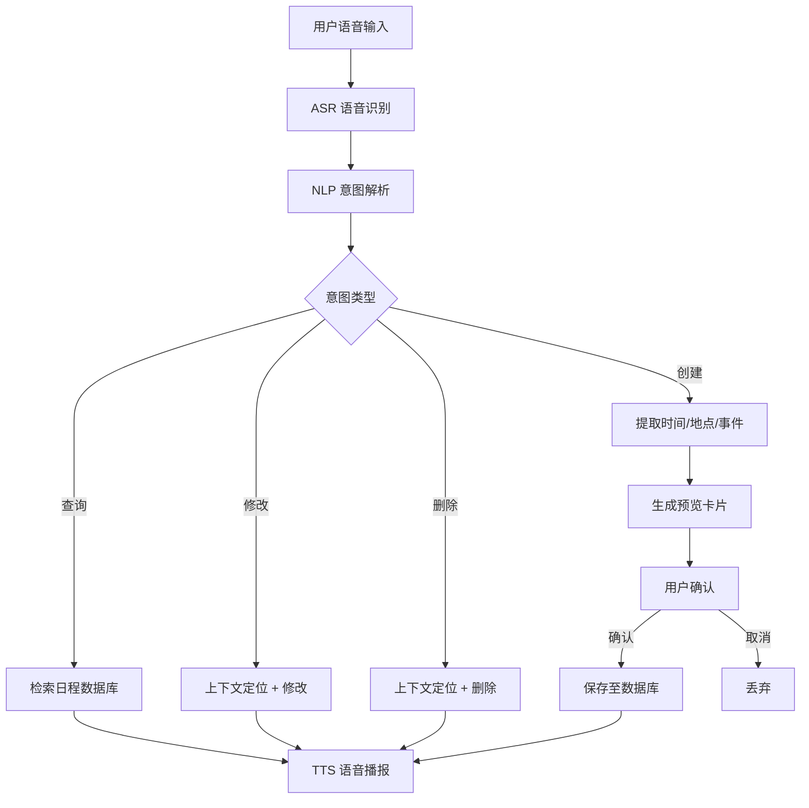

# 「言程」Vocalendar — 产品需求文档（PRD）

## 1. 产品概述
「言程」是一款以"Voice-First（语音优先）"为核心设计理念的智能日历管理工具，通过 NLP 和 ASR 技术将口语化表达转化为结构化日程，让用户在通勤、驾驶、做家务等场景下无需打字即可高效管理时间。
- 解决传统日历操作繁琐、场景受限、表达不自然三大痛点
- 目标用户：职场精英、驾驶人群、视障人士/老年人

## 2. 核心功能

### 2.1 用户角色
| 角色 | 注册方式 | 核心权限 |
|------|----------|----------|
| 普通用户 | 邮箱注册/登录 | 语音创建、查询、修改、删除日程，管理个人设置 |
| 访客 | 无需注册 | 浏览产品介绍页，了解功能特性 |

### 2.2 功能模块
1. **主页面**：语音交互入口、日历视图、当日日程概览、语音波形动画
2. **日程管理页**：日程列表、搜索筛选、批量操作
3. **设置页**：API Key 配置、提醒偏好、账户管理

### 2.3 页面详情
| 页面名称 | 模块名称 | 功能描述 |
|----------|----------|----------|
| 主页面 | 语音交互区 | 点击麦克风按钮开始语音输入，实时显示语音波形动画，识别文本实时展示，解析结果确认卡片 |
| 主页面 | 日历视图 | 月/周/日三种视图切换，日程标记点，点击日期查看当日日程 |
| 主页面 | 当日日程概览 | 时间轴形式展示当日日程，显示时间、标题、地点标签 |
| 主页面 | 智能提醒浮层 | 事件前语音播报提醒，浮层展示提醒内容 |
| 日程管理页 | 日程列表 | 按日期分组展示所有日程，支持滑动删除 |
| 日程管理页 | 搜索筛选 | 按关键词、日期范围、标签筛选日程 |
| 日程管理页 | 批量操作 | 多选日程进行批量删除、修改 |
| 设置页 | API Key 配置 | 输入并保存 ASR/NLP/TTS 服务的 API Key，加密存储 |
| 设置页 | 提醒偏好 | 设置默认提醒时间（提前5/10/15/30分钟），提醒方式（语音/通知） |
| 设置页 | 账户管理 | 修改密码、退出登录 |

## 3. 核心流程

### 3.1 语音创建日程流程
用户点击麦克风 → 开始录音 → ASR 语音识别为文本 → NLP 解析提取时间/地点/事件 → 生成日程预览卡片 → 用户语音/点击确认 → 保存日程 → TTS 语音反馈确认

### 3.2 对话式查询流程
用户语音提问 → ASR 识别 → NLP 意图识别（查询类）→ 检索日程数据 → TTS 语音播报结果

### 3.3 修改/删除流程
用户语音指令 → ASR 识别 → NLP 意图识别（修改/删除类）+ 上下文理解 → 定位目标日程 → 执行操作 → TTS 语音反馈

## 4. 用户界面设计

### 4.1 设计风格
- **主色调**：深靛蓝（#1E3A5F）搭配暖橙（#FF8C42）作为强调色，传达专业与温度并存的品牌感
- **辅助色**：浅灰蓝（#E8EDF2）背景、白色卡片、柔绿（#4CAF50）成功状态、柔红（#E57373）删除状态
- **按钮风格**：圆角胶囊按钮，主按钮带微妙阴影和悬停缩放效果
- **字体**：标题使用 Noto Serif SC（衬线体，传达雅致感），正文使用 Noto Sans SC（无衬线，清晰易读）
- **布局风格**：左侧日历面板 + 右侧日程详情的双栏布局，移动端切换为单栏
- **图标风格**：线性图标（Lucide），线条粗细一致，2px 描边
- **动效**：语音输入时麦克风脉冲动画，日程卡片入场滑入，页面切换淡入淡出

### 4.2 页面设计概览
| 页面名称 | 模块名称 | UI 元素 |
|----------|----------|---------|
| 主页面 | 语音交互区 | 居中大圆形麦克风按钮（渐变背景+脉冲动画），下方实时文本展示区，解析结果卡片（圆角+阴影） |
| 主页面 | 日历视图 | 左侧月历网格，当日高亮圆圈，有日程的日期下方小圆点标记，顶部视图切换标签 |
| 主页面 | 当日日程概览 | 右侧垂直时间轴，时间标签左侧，日程卡片右侧，地点标签带图标 |
| 日程管理页 | 日程列表 | 日期分组标题，日程卡片（左侧色条+标题+时间+地点），右滑删除手势 |
| 日程管理页 | 搜索筛选 | 顶部搜索栏（圆角+搜索图标），筛选标签组 |
| 设置页 | API Key 配置 | 分组卡片，每个 Key 一个输入框（密码模式）+ 保存按钮，连接状态指示灯 |

### 4.3 响应式设计
- 桌面优先设计，断点：移动端 < 768px，平板 768-1024px，桌面 > 1024px
- 移动端：单栏布局，底部固定麦克风按钮，日历和日程上下排列
- 平板：可折叠侧边栏，主内容区自适应
- 触控优化：麦克风按钮触控区域 ≥ 48px，日程卡片点击区域充足

### 4.4 语音交互视觉反馈
- 待机状态：麦克风图标静态，柔和呼吸光晕
- 录音中：麦克风脉冲扩散动画，声波纹可视化
- 识别中：文本逐字出现打字机效果
- 解析完成：结果卡片从下方滑入，字段高亮标注
- 播报中：扬声器图标声波动画
