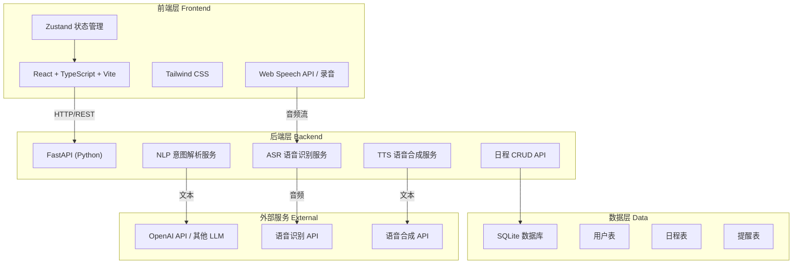
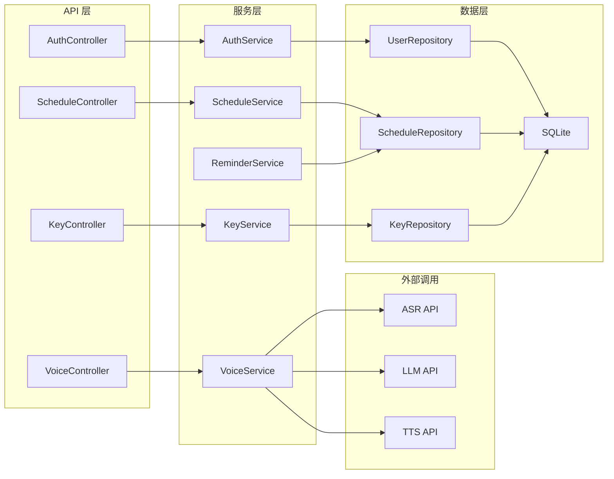
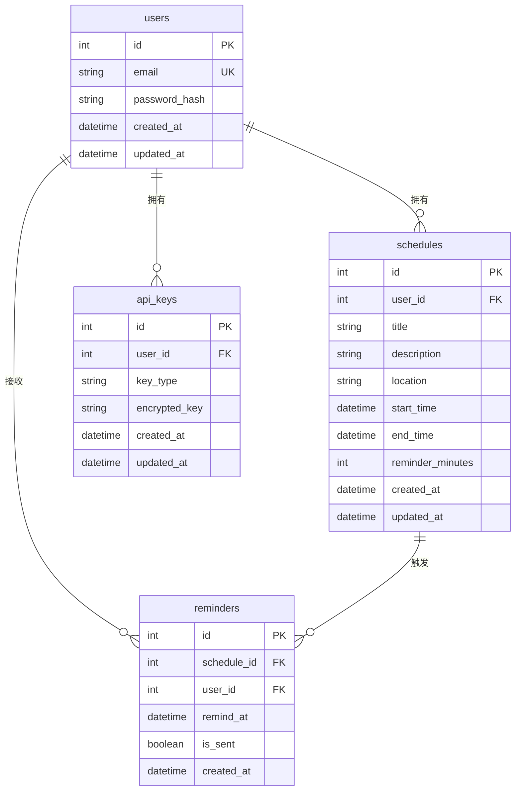

# 「言程」Vocalendar — 技术架构文档

## 1. 架构设计



## 2. 技术说明
- **前端**：React@18 + TypeScript + Vite + Tailwind CSS@3 + Zustand
- **初始化工具**：vite-init（react-ts 模板）
- **后端**：FastAPI (Python 3.11+)
- **数据库**：SQLite（开发阶段，轻量级，无需额外安装）
- **语音识别**：通过后端调用 ASR API（如 Whisper API / 讯飞语音）
- **NLP 解析**：通过后端调用 LLM API（如 OpenAI GPT / 通义千问）
- **语音合成**：通过后端调用 TTS API（如 Edge TTS / 讯飞语音）
- **API Key 管理**：前端配置页面输入 API Key，通过 HTTPS 传输至后端，后端加密存储于数据库

## 3. 路由定义
| 路由 | 用途 |
|------|------|
| `/` | 主页面 - 日历视图 + 语音交互 + 当日日程 |
| `/schedule` | 日程管理页 - 日程列表 + 搜索筛选 |
| `/settings` | 设置页 - API Key 配置 + 提醒偏好 + 账户管理 |
| `/login` | 登录页 - 邮箱密码登录 |
| `/register` | 注册页 - 邮箱注册 |

## 4. API 定义

### 4.1 认证相关
```typescript
// POST /api/auth/register
interface RegisterRequest {
  email: string;
  password: string;
}
interface RegisterResponse {
  token: string;
  user: { id: number; email: string };
}

// POST /api/auth/login
interface LoginRequest {
  email: string;
  password: string;
}
interface LoginResponse {
  token: string;
  user: { id: number; email: string };
}
```

### 4.2 语音处理
```typescript
// POST /api/voice/process
interface VoiceProcessRequest {
  audio_base64: string;  // Base64 编码的音频数据
  api_keys: {
    asr_api_key?: string;
    nlp_api_key?: string;
    tts_api_key?: string;
  };
  context?: {
    last_event_id?: number;  // 上下文：最近操作的日程 ID
  };
}
interface VoiceProcessResponse {
  transcript: string;           // 语音识别文本
  intent: 'create' | 'query' | 'modify' | 'delete' | 'unknown';
  extracted: {
    title?: string;
    datetime?: string;          // ISO 8601 格式
    location?: string;
    description?: string;
  };
  result?: {
    events?: ScheduleEvent[];   // 查询结果
    modified_event?: ScheduleEvent;
    deleted_ids?: number[];
  };
  audio_response_base64?: string;  // TTS 语音反馈
  confirm_required: boolean;    // 是否需要用户确认
}
```

### 4.3 日程 CRUD
```typescript
// GET /api/schedules?date=2026-06-16&range=week
interface ScheduleEvent {
  id: number;
  user_id: number;
  title: string;
  description?: string;
  location?: string;
  start_time: string;  // ISO 8601
  end_time?: string;   // ISO 8601
  reminder_minutes?: number;
  created_at: string;
  updated_at: string;
}

// POST /api/schedules
interface CreateScheduleRequest {
  title: string;
  description?: string;
  location?: string;
  start_time: string;
  end_time?: string;
  reminder_minutes?: number;
}

// PUT /api/schedules/:id
interface UpdateScheduleRequest {
  title?: string;
  description?: string;
  location?: string;
  start_time?: string;
  end_time?: string;
  reminder_minutes?: number;
}

// DELETE /api/schedules/:id
interface DeleteScheduleResponse {
  success: boolean;
  message: string;
}
```

### 4.4 API Key 管理
```typescript
// POST /api/keys
interface SaveKeysRequest {
  asr_api_key?: string;
  nlp_api_key?: string;
  tts_api_key?: string;
}

// GET /api/keys
interface GetKeysResponse {
  asr_api_key_set: boolean;   // 仅返回是否已设置，不返回明文
  nlp_api_key_set: boolean;
  tts_api_key_set: boolean;
}

// POST /api/keys/test
interface TestKeyRequest {
  key_type: 'asr' | 'nlp' | 'tts';
  api_key: string;
}
interface TestKeyResponse {
  success: boolean;
  message: string;
}
```

## 5. 后端架构图



## 6. 数据模型

### 6.1 数据模型定义



### 6.2 数据定义语言（DDL）

```sql
-- 用户表
CREATE TABLE users (
    id INTEGER PRIMARY KEY AUTOINCREMENT,
    email TEXT NOT NULL UNIQUE,
    password_hash TEXT NOT NULL,
    created_at TIMESTAMP DEFAULT CURRENT_TIMESTAMP,
    updated_at TIMESTAMP DEFAULT CURRENT_TIMESTAMP
);

-- 日程表
CREATE TABLE schedules (
    id INTEGER PRIMARY KEY AUTOINCREMENT,
    user_id INTEGER NOT NULL,
    title TEXT NOT NULL,
    description TEXT,
    location TEXT,
    start_time TIMESTAMP NOT NULL,
    end_time TIMESTAMP,
    reminder_minutes INTEGER DEFAULT 15,
    created_at TIMESTAMP DEFAULT CURRENT_TIMESTAMP,
    updated_at TIMESTAMP DEFAULT CURRENT_TIMESTAMP,
    FOREIGN KEY (user_id) REFERENCES users(id) ON DELETE CASCADE
);

-- API Key 表
CREATE TABLE api_keys (
    id INTEGER PRIMARY KEY AUTOINCREMENT,
    user_id INTEGER NOT NULL,
    key_type TEXT NOT NULL CHECK(key_type IN ('asr', 'nlp', 'tts')),
    encrypted_key TEXT NOT NULL,
    created_at TIMESTAMP DEFAULT CURRENT_TIMESTAMP,
    updated_at TIMESTAMP DEFAULT CURRENT_TIMESTAMP,
    FOREIGN KEY (user_id) REFERENCES users(id) ON DELETE CASCADE,
    UNIQUE(user_id, key_type)
);

-- 提醒表
CREATE TABLE reminders (
    id INTEGER PRIMARY KEY AUTOINCREMENT,
    schedule_id INTEGER NOT NULL,
    user_id INTEGER NOT NULL,
    remind_at TIMESTAMP NOT NULL,
    is_sent BOOLEAN DEFAULT FALSE,
    created_at TIMESTAMP DEFAULT CURRENT_TIMESTAMP,
    FOREIGN KEY (schedule_id) REFERENCES schedules(id) ON DELETE CASCADE,
    FOREIGN KEY (user_id) REFERENCES users(id) ON DELETE CASCADE
);

-- 索引
CREATE INDEX idx_schedules_user_id ON schedules(user_id);
CREATE INDEX idx_schedules_start_time ON schedules(start_time);
CREATE INDEX idx_reminders_remind_at ON reminders(remind_at);
CREATE INDEX idx_reminders_is_sent ON reminders(is_sent);
```
